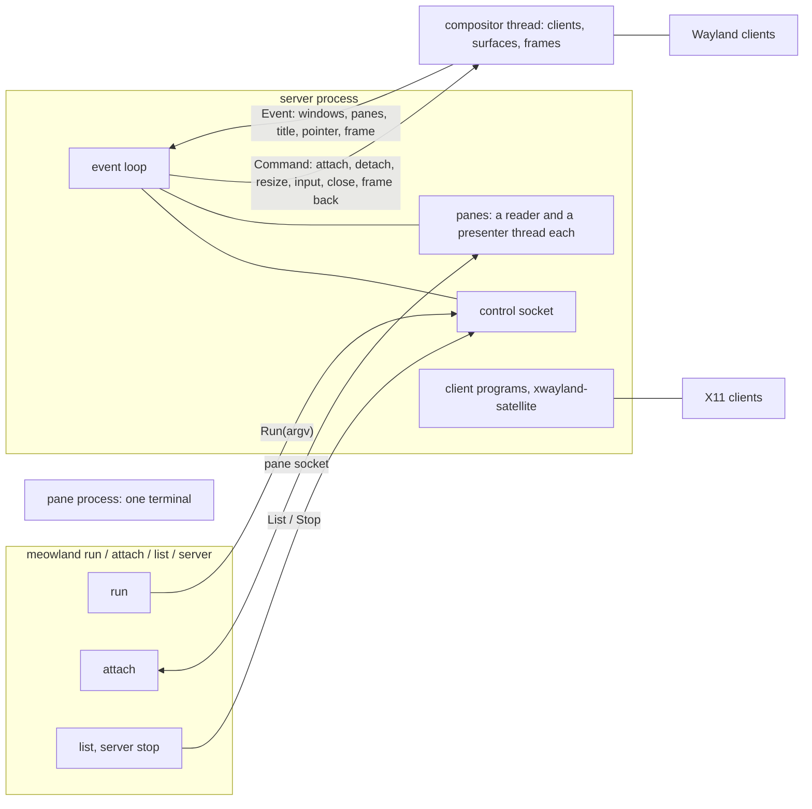
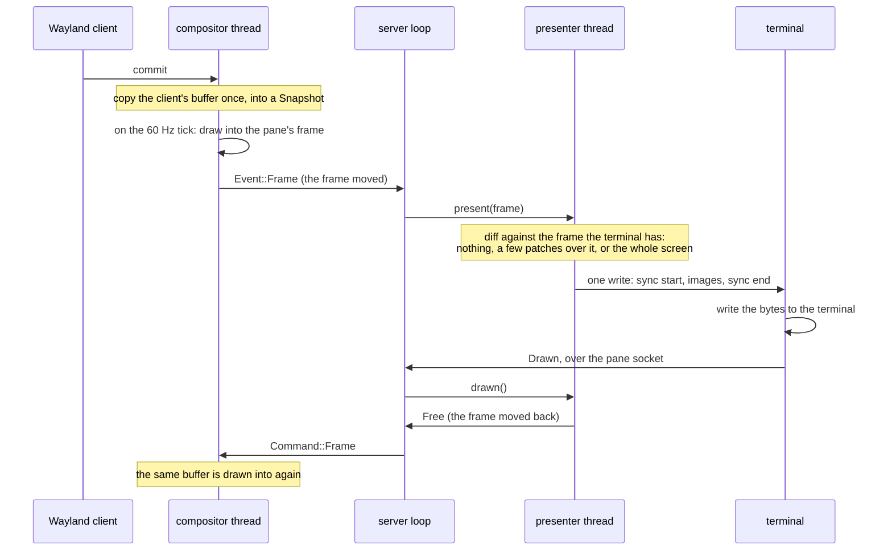
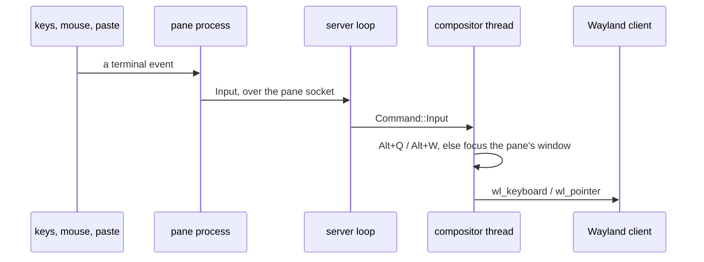
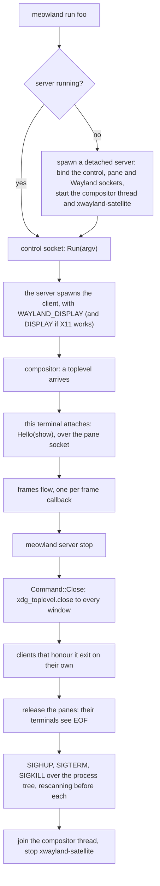

# meowland

A Wayland compositor that draws windows in a terminal with the kitty graphics
protocol. A server outlives every terminal; each terminal is a *pane* showing
one window. Nothing is tiled: a pane is one window, as big as the terminal it is
in.

## Processes and sockets

The compositor holds the Wayland clients and the frames they add up to; the
server holds the panes, the control socket, and the programs it started. They
reach each other only in messages (`src/wayland/message.rs`), so composing a
frame never makes an input event wait.

## A frame

A pane has one frame. The compositor draws into it and cannot draw that pane
again until the presenter gives it back. The screen the terminal shows is one
kitty image, and a frame that changes only part of it is sent as patches over
that image: tiles of the screen, each a whole number of cells across and down,
placed in the cell their top-left pixel is in — which is what keeps a patch on
the pixels it holds. A frame that changes too much of the screen, or that takes
too many tiles, goes whole.

Frames are dropped while a pane's terminal is behind: the frame drawn next is
the scene as it is then, so nothing that changed is lost. The frame itself is
moved between the three threads and back, never copied, and its bytes go to the
socket out of the buffer they were encoded in — a byte string, not a write per
byte. The presenter keeps the pixels it last sent, swapping each frame's buffer
with its own, and that is what a new frame is diffed against.

## Input

Terminals do not have to report key releases, so a press is sent as a press and
a release, and the terminal's own repeat is what a held key looks like.

## Starting and stopping

